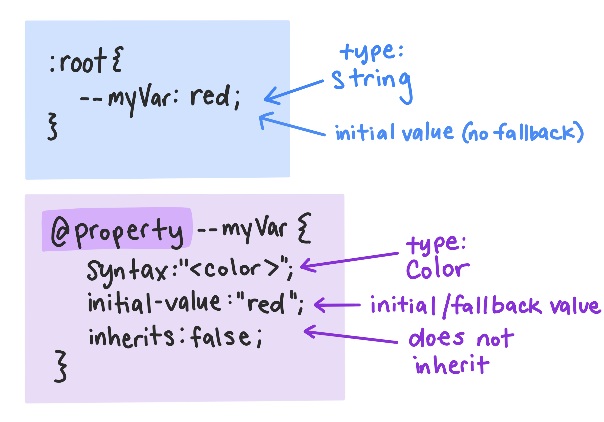

[CSS Houdini](http://ishoudinireadyyet.com/) is an umbrella term that covers a set of low-level APIs which expose parts of the CSS rendering engine, and give developers much more available access to the CSS Object Model. This is a huge change for the CSS ecosystem, as it enables developers to tell the browser how to read and parse custom CSS without waiting for browser vendors to natively implement these features. So exciting!



And one of the most exciting additions to CSS within the Houdini umbrella is the [Properties and Values API](https://drafts.css-houdini.org/css-properties-values-api/). This API supercharges your CSS custom properties (also commonly referred to as CSS variables) by giving them semantic meaning (tied to a syntax) and even fallback values, enabling CSS testing! With the `@property` shorthand landing in Chrome 84, we can now write Houdini-powered custom properties directly in our CSS.



*CSS custom properties* can be set on any element, including the `:root` element, are prefixed by `--`, and represent dynamic values that are accessed with the `var()` function.



## Writing Houdini Custom Properties

Here's an example of registering a houdini custom property with a defined syntax, initial value, and inheritance statement:

<div class="w-columns">

```js
CSS.registerProperty({
  name: '--colorPrimary',
  syntax: '<color>',
  initialValue: magenta,
  inherits: false
})
```


Previously, we would first register the custom property in a JavaScript file and include it within our file source.





```css
@property --colorPrimary {
  syntax: '<color>';
  initial-value: magenta;
  inherits: false;
}
```

The new **@property** syntax enables Houdini custom properties to be written in CSS.



</div>


Now you can access `--colorPrimary` like any other CSS custom property, via `var(--colorPrimary)`. However, the difference here is that `colorPrimary` isn't just read as a string like a basic custom property is. It has data! The data that we can add to Houdini Custom Properties are:

- **name**: *(string)* — The name of the custom property.
- **syntax**: *(string)* — The type of value for the custom property. See this [list of all possible values](https://drafts.csswg.org/css-values-3/) in the CSS Values 3 spec.
- **initial-value**: *(string)* — Initial and fallback value for the custom property.
- **inherits**: *(boolean)* — Identifies if the custom property inherits its parent's value. 

## Fallback Values

As with any other custom property, you can *get* (via `var(--varNamr)`) or *set* (write/rewrite) values, but with Houdini custom properties, if you set a falsey value when overwriting the value, the CSS rendering engine will send the initial value (its fallback value) instead of ignoring the line.

```css
.card {
background-color: var(--colorPrimary); /* magenta */
}

.highlight-card {
--colorPrimary: yellow;
background-color: var(--colorPrimary); /* yellow */
}

.another-card {
--colorPrimary: 23;
background-color: var(--colorPrimary); /* magenta */
}
```

Without a registered property, the line with a falsy value would typically be ignored, so this makes CSS fall backs and testing possible.


While the value of a Houdini custom property can be reassigned, it's syntax, inheritance, and initialValue cannot be changed after initial registration.



-- DIAGRAM OR DEMO OF NON-HOUDINI VS HOUDINI FALLBACKS --

## Semantic CSS

With the syntax feature, we can now write semantic CSS. As mentioned earlier, this allows for the custom properties we set to be more than just strings, meaning that as typed values, they can be more easily parsed by the rendering engine. That means: **faster CSS rendering!**

But speed isn't the only benefit. We can now 

Let's take a look at animating a gradient stop. Currently, there is no way to smoothly animate (or interpolate) between gradient values, as each gradient declaration is parsed as a string. But with registered custom properties, we can define values and syntaxes for the browser to read and render.

-- show example of trying to go from one gradient to another on hover --

Example with stop / angle-shifting gradient similar to una.im/random-selective-colors/

## Browser Support


It's important to remember that support for this feature is still limited. However, with many browsers now on board, the properties and values API is something you can definitely experiment with (TODO: reword).


<iframe
  src="https://ishoudinireadyyet.com/"
  alt="Is Houdini Ready Yet? Website"
  style="height: 450px; width: 100%; border: 1px solid lightgray">
</iframe>
